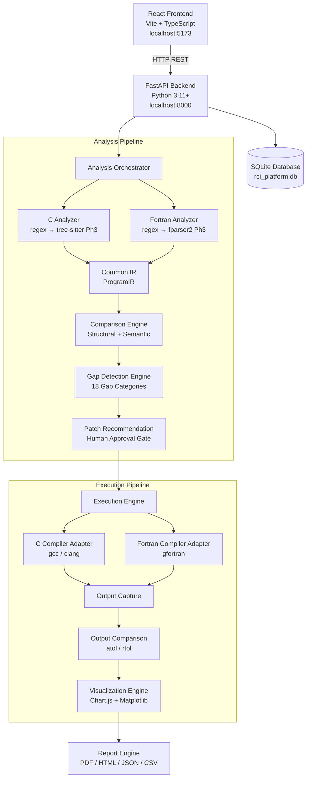

# Architecture — RCI Code Equivalence Platform

## System Overview



## Component Responsibilities

### Frontend (React + Vite)
- Renders the engineering dashboard
- Sends all API calls to `localhost:8000` only (proxy via Vite dev server)
- No external CDN dependencies (Chart.js bundled locally)
- Monaco Editor integration planned for Phase 2

### Backend (FastAPI)
- Receives multipart file uploads (source code in memory only)
- Orchestrates the full analysis pipeline
- Serves structured JSON to the frontend
- Manages SQLite DB for session metadata
- Binds to `127.0.0.1` only

### Analysis Orchestrator
- Dispatches to language-specific analyzers
- Coordinates IR generation, comparison, and gap detection
- Returns a unified `AnalysisResult` to the API layer

### Common Intermediate Representation (IR)
The most important component. Both C and Fortran ASTs are normalized into:
```
ProgramIR
├── ProgramMetadata (filename, language, LOC, parser used)
├── functions: List[FunctionIR]
│   ├── name, source_language, kind (function/subroutine/program)
│   ├── parameters: List[VariableIR]
│   ├── local_variables: List[VariableIR]
│   ├── return_type: CanonicalType
│   ├── calls: List[str]
│   └── flags: has_loops, has_conditionals, has_io, has_implicit_none
├── global_variables: List[VariableIR]
├── constants: List[VariableIR]
└── includes / modules
```

Key normalization rules:
- Array indices: Fortran 1-based → 0-based logical offset in IR
- Types: all mapped to CanonicalType (FLOAT32, FLOAT64, INT32, etc.)
- Loop style: DO / for / while all represented as LoopIR

### Gap Detection Engine
Classifies differences into 18 categories. Each gap contains:
- `gap_id` — sequential (GAP-001, GAP-002…)
- `category` — from the 18 GapCategory enum values
- `severity` — LOW / MEDIUM / HIGH / CRITICAL
- `confidence` — 0.0–1.0 from deterministic analysis
- `suggested_resolution` — deterministic rule-based suggestion

### Execution Engine (Phase 8)
- Compiles C with `gcc -Wall -O0 -lm`
- Compiles Fortran with `gfortran -Wall -O0`
- Runs each binary with identical stdin
- Enforces hard timeout (configurable, default 30s)
- Strips environment variables from child processes
- Cleans up temp directories automatically

## Data Flow

```
Upload C + Fortran files (multipart form)
    ↓
File size validation (max 5MB default)
    ↓
Security pattern scan (warns on system(), popen(), etc.)
    ↓
C Analyzer → C ProgramIR
Fortran Analyzer → Fortran ProgramIR
    ↓
compare_programs() → ComparisonResult
    ↓
GapDetectionEngine.detect() → List[GapReport]
    ↓
Store metadata in SQLite (NOT source content)
    ↓
Return AnalysisResult JSON to frontend
```

## Directory Structure

```
rci-code-equivalence-platform/
├── backend/
│   ├── app/
│   │   ├── main.py              ← FastAPI factory + lifespan
│   │   ├── config.py            ← Pydantic settings
│   │   ├── database.py          ← SQLAlchemy async SQLite
│   │   ├── api/                 ← Route handlers
│   │   ├── models/              ← ORM models
│   │   ├── schemas/             ← Pydantic I/O schemas
│   │   ├── services/            ← Compiler detection, system info
│   │   ├── analyzers/c/         ← C AST/structural analysis
│   │   ├── analyzers/fortran/   ← Fortran AST/structural analysis
│   │   ├── ir/                  ← Common IR models
│   │   ├── comparison/          ← Structural comparison engine
│   │   ├── gap_detection/       ← 18-category gap classifier
│   │   ├── patch_generation/    ← Patch recommendation (Phase 7)
│   │   ├── execution/           ← Safe subprocess execution
│   │   ├── security/            ← Input validation, sandbox
│   │   └── utils/               ← Logging, helpers
│   └── tests/
├── frontend/
│   └── src/
│       ├── pages/               ← 8 page components
│       ├── components/          ← Reusable UI components
│       ├── services/api.ts      ← Typed API client
│       └── types/index.ts       ← TypeScript types
├── examples/                    ← Demo C + Fortran programs
└── docs/                        ← This documentation
```
